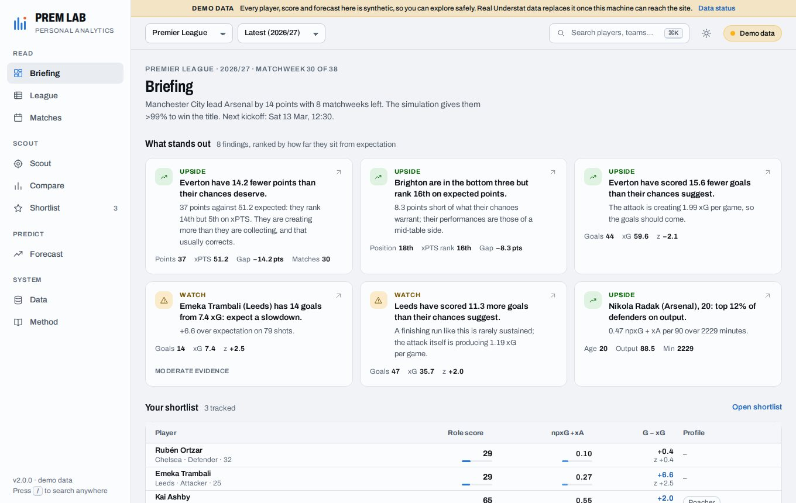
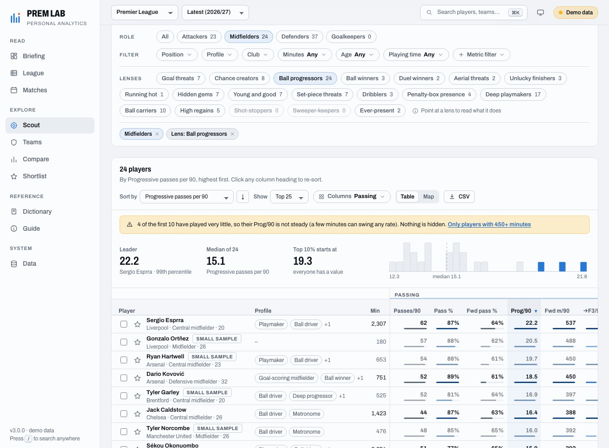
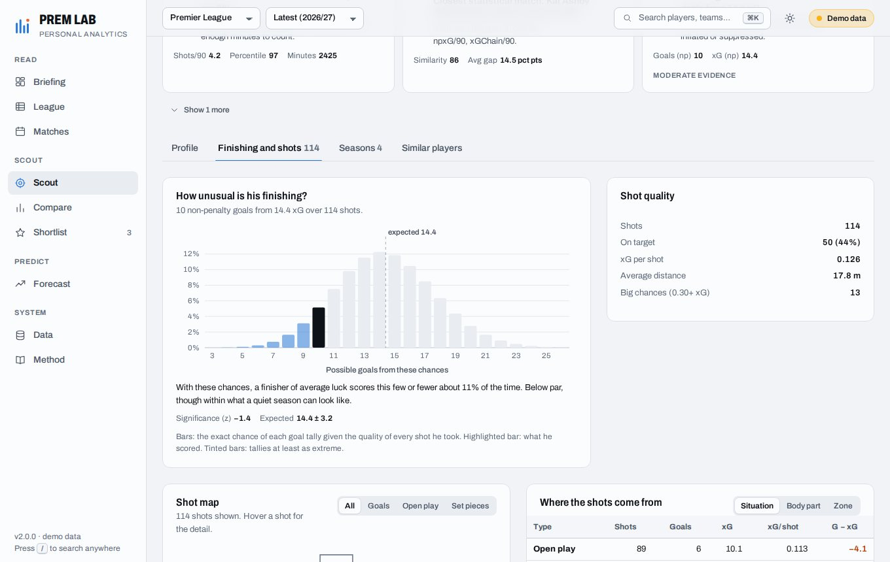
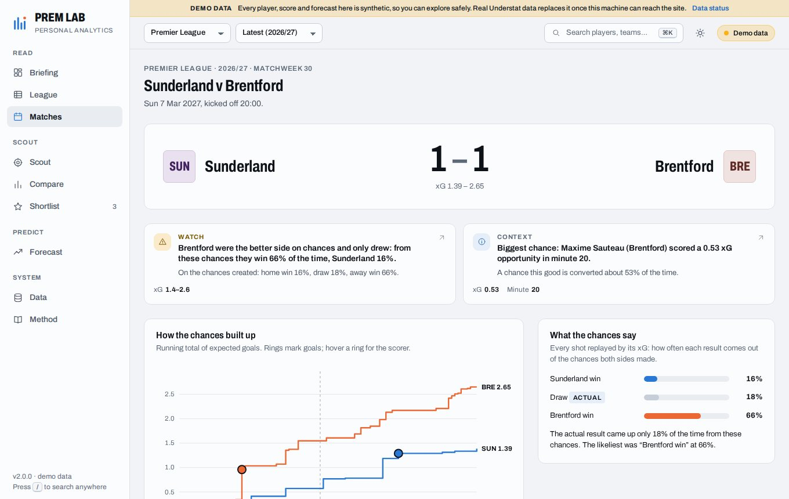

# Prem Lab

A personal football analytics workbench built on [Understat](https://understat.com) data. It runs on your own computer, keeps everything in a local cache, and is designed to answer questions rather than show dashboards: *who is really better than their results, who is worth scouting, what happens next.*

Unofficial. Not affiliated with or endorsed by Understat.

| Briefing | Scout |
| --- | --- |
|  |  |
| **Player** | **Match report** |
|  |  |

*The screenshots use the built-in demo world (synthetic players and results), not real data.*

## What it is for

Every page opens with findings, then the evidence.

- **Briefing** – what stands out right now: teams above or below what their chances deserve, players riding luck, the title, top-four and relegation races, the next fixtures, and the players on your shortlist.
- **League** – standings read three ways (results, expected, style), attack against defence, and the table race matchweek by matchweek.
- **Team** – results against chances in every match, percentile profile against the league, rolling form, splits, fixtures with forecasts, squad contributions, and where chances come from.
- **Scout** – filter and rank players by role, minutes, age, club and finishing luck; one-click lenses ("Goal threats", "Unlucky finishers", "Hidden gems", "Young and good"); a table with percentile bars or a map; tick players to compare.
- **Player** – profile against role peers, an exact "how unusual is his finishing" distribution, shot map, season-by-season trend, and statistically similar players (optionally younger, or from other leagues).
- **Compare** – players (percentile dot plot with the differences spelled out) or two teams.
- **Matches** – every match next to the chances behind it, "results that lied", and a match report with xG race, shot map and deserved result.
- **Forecast** – upcoming fixtures, a match lab for any pairing, the season simulated thousands of times, and a walk-forward accuracy check of the model.
- **Shortlist** – players you track, live numbers and your own notes.
- **Data** and **Method** – sync and cache status, a connection check, and plain-language documentation of every number.

### Ideas the numbers are built on

1. Results are noisy; the quality of chances is steadier. Expected points replay every shot of every match.
2. Small samples are treated cautiously: peers need enough minutes, and rates are pulled toward the role average in proportion to how little football stands behind them.
3. Everyone is compared with their own role, so a percentile means the same thing on every page.
4. Luck is measured, not guessed: a player's goals are placed in the exact distribution of goals his shots could have produced.

## Run it

Requires Python 3.11+. With [uv](https://docs.astral.sh/uv/):

```bash
uv sync --extra dev
uv run prem doctor          # can this machine reach and read Understat?
uv run prem sync --leagues EPL --seasons 2025,2026
uv run prem serve           # http://127.0.0.1:8000, opens a browser
```

Just want to look around first? `uv run prem serve --demo` serves a synthetic league that needs no network.

| Command | What it does |
| --- | --- |
| `prem serve` | Run the app. `--demo`, `--offline`, `--port`, `--data-dir`, `--no-open`, `--reload` |
| `prem sync` | Fetch league seasons, and their club squad lists (exact birthdates), into the cache (`--leagues EPL,La_liga`, `--seasons 2025,2026`, `--force`) |
| `prem doctor` | Walk the real data path once and report which step fails |
| `prem status` | Show what is cached and how old it is |
| `prem clear --yes` | Delete cached match and player data (your shortlist stays) |

Understat is read at a polite pace (a few requests per second, with retries), so a first sync of several seasons takes minutes. Finished seasons never change and are fetched once. Live seasons refresh when their cache is a few hours old; if a refresh fails you keep seeing the saved data, flagged as stale.

### Configuration

| Variable | Meaning |
| --- | --- |
| `PREM_DATA_DIR` | Where the cache lives (default `<repo>/.prem-data`, or `~/.prem-lab` when installed) |
| `PREM_DEMO=1` | Serve the synthetic demo world |
| `PREM_OFFLINE=1` | Never touch the network; serve what is cached |
| `PREM_TODAY=YYYY-MM-DD` | Pretend today is this date (demo and testing) |

### Event data (optional): duels, tackles and passing

Understat only records shots, so it has no defensive duels, tackles, interceptions or passing measures. An optional second source, WhoScored (read through the [`soccerdata`](https://soccerdata.readthedocs.io) package), fills that gap. It is off until you fetch some, and nothing else in the app depends on it.

```bash
uv run --extra events prem events sync --league EPL --seasons 2025
uv run prem events status
```

- **Slow, once.** A match takes about 15 seconds, so a full league season is roughly two hours. Every match is stored in the local database as soon as it is read and is never fetched again. Stop it any time (Ctrl+C) and run the same command to carry on; later runs only fetch matches played since.
- **Raw pages are kept too.** `soccerdata` caches each match page in `<data dir>/soccerdata` (about 0.3 MB a match), so a definition can be improved and everything re-read without going back to the website. Delete that folder to reclaim the space; matches already stored keep working.
- **Needs a browser.** Chrome, Chromium, Brave or Edge must be installed (it is found automatically; `--browser PATH` overrides). Add `--visible` if the site blocks the hidden window.
- **Where it shows up.** Scout gets a **Defending & passing** column set and two lenses (Ball winners, Progressors); each player page gets a **Defending and passing** table; the Data page shows progress and which players could not be matched safely. Definitions are on the Method page.
- **What it adds:** forward-pass ratio, progressive passes, defensive duels with win rate, tackles, interceptions, recoveries and aerial win rate, all per 90 and ranked among players in the same role who have event data. Playing time is scaled so a full match is 90 minutes. Existing role scores and percentiles are never changed by it.
- **Safe by design.** Players are matched to Understat by name and club and left out rather than guessed. `prem clear` keeps event data unless you add `--events`.
- **Personal use only.** It reads a public website, which that site's terms may not allow, so it only runs when you start it and keeps what it reads on your own computer. Do not publish the data.

### Ages

Understat has no birthdates, so ages come from two places, in this order:

1. **Club squad lists (ESPN's public JSON feed).** Each club's squad for a season lists its players with their exact date of birth, goalkeepers included. A player is matched to Understat by the *words of his name and his club*, never by a looser guess (spelling variants such as "Vitalii" / "Vitaliy" are handled, and "Gabriel" on Understat is matched to "Gabriel dos Santos Magalhães" only when he is the one unmatched candidate at that club). In a check against WhoScored's own ages for the Premier League, all 466 players that could be compared agreed. It is about 20 requests for a league and season, made in the background the first time you open Scout (or by `prem sync`), stored for good for finished seasons, and refreshed daily for the current one. A birthdate belongs to the player, not the season, so every stored list is used in every view: someone who has since moved on is found on the list of the club he went to. If the feed has almost nothing for a season (it has one player per club for Serie A 2023, for example) the Data page marks that season as sparse, asks again after a week, and ages there come from the other lists and from Wikidata.
2. **Wikidata, for the players a squad list leaves out** (a few per cent: club-name aliases, rarely a first name written differently). Wikidata has many retired namesakes, so the app is deliberately strict: it only trusts a match that is a plausible footballing age on the date in question, prefers a club the player is at *now* (a club someone left years ago does not count), and refuses to guess for single-word names. Where it cannot be sure the age stays blank, and an age matched by name alone is shown with a `?` but never decides anything: the age filter, similar-player searches and the young-talent highlights treat it as unknown.

The Scout age filter hides players with no sure age (the Age menu says how many, and can show them). The Data page shows, per league and season, how many players the squad lists matched, who is still unknown, and any player where Wikidata, sure of the club, disagrees. Both feeds are public but undocumented and used for personal use only; if one is unreachable, ages simply stay as they were.

If an age is wrong or missing, correct it yourself in `<data dir>/birthdates.json` (read at start-up). Use `"Name"` or, to tell two players of the same name apart, `"Name|Club"`:

```json
{ "Sávio": "2004-04-10", "Pablo Ibáñez|Alaves": "1998-08-03" }
```

### Managers

Understat has no manager data. To split a team's season by manager, add your own stints to `<data dir>/managers.json` (same shape as [`src/app/data/managers.json`](src/app/data/managers.json)); they are merged in and appear on the Team page.

### Docker

```bash
docker build -t prem-lab .
docker run --rm -p 8000:8000 -v prem-data:/data prem-lab
```

The image serves the app on port 8000 and keeps the cache in the `/data` volume.

## How it is built

```
Understat ──> client (paced, retrying) ──> SQLite payload store ──> repository ──> typed models
                                                                        │
              analytics (players, teams, league, matches, similarity) ◄─┤
              forecast  (ratings, Elo, scorelines, season simulation)  ◄─┤
              insights  (ranked, evidence-backed findings)              ◄─┘
                                        │
                                  workbench (page-shaped views) ──> FastAPI ──> no-build web app
```

- `src/app/data` – the local-first data layer: Understat client, SQLite store, repository (single-flight fetches, stale fallback, offline mode), typed models, squad-list and Wikidata birthdate resolvers, and a synthetic demo world simulated shot by shot.
- `src/app/analytics`, `src/app/forecast`, `src/app/insights` – the analysis. Everything is a plain function over typed models and is unit tested.
- `src/app/workbench.py`, `src/app/api.py` – one service composes views for the pages; the API is thin and uses one error format.
- `src/app/web` – the frontend: vanilla ES modules on a vendored Preact + htm, hash-routed (the URL carries page state), custom SVG charts, no build step and no runtime network dependencies.

## Tests

```bash
uv run pytest                       # backend: data layer, analytics, forecasts, insights, API
npm install && npm test             # pure frontend helpers (node:test)
uv run prem serve --demo --no-open --port 8765 --today 2027-03-10 &
npm run e2e                         # drives the real UI in headless Chromium against the demo world
npm run shoot -- --routes "/;/scout" --theme light,dark --size 1440x900,390x844   # screenshots + console/overflow checks
```

The Understat endpoint notes that the data layer is based on are in [docs/understat_endpoint_inventory.md](docs/understat_endpoint_inventory.md).

## Licence

MIT. Data belongs to Understat and its sources; respect their terms and keep the request rate low.
