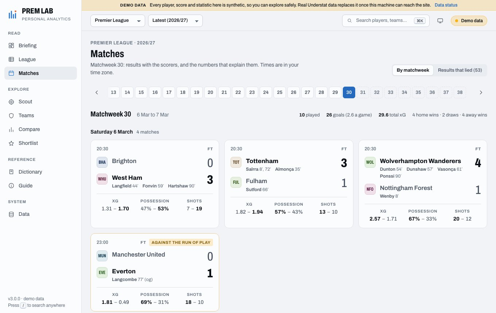
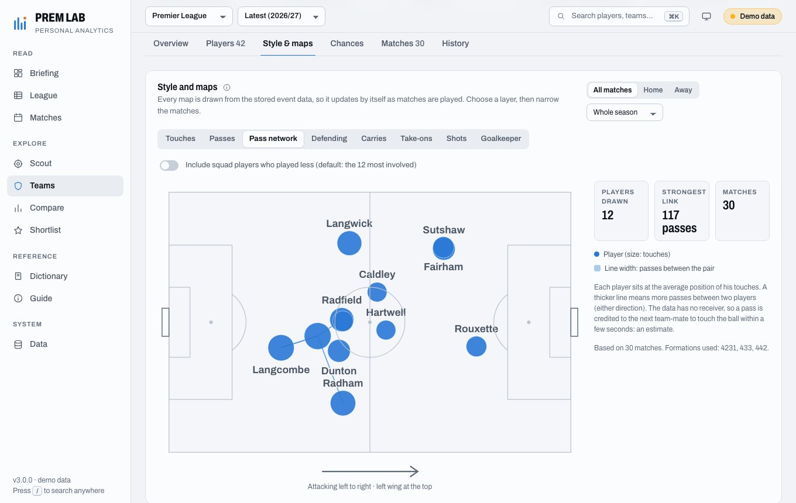
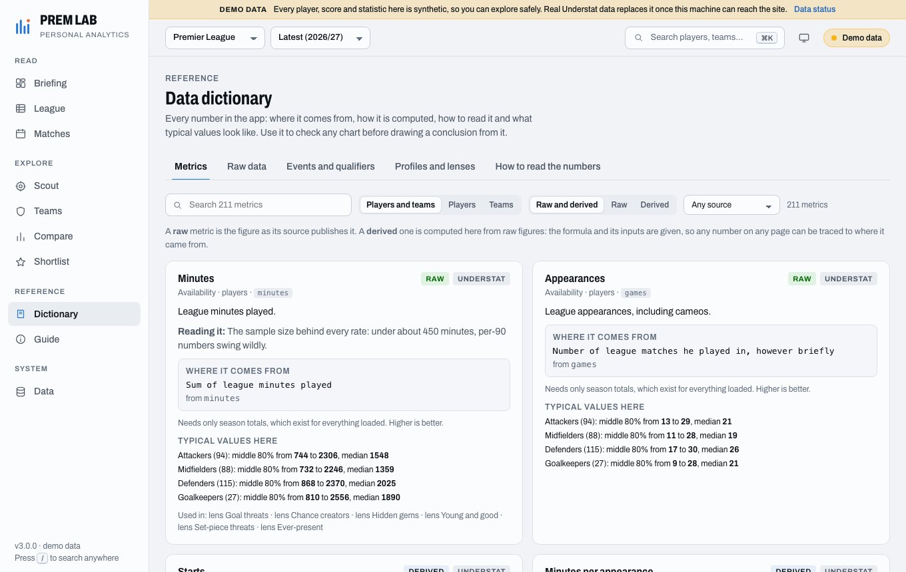

# Prem Lab

A personal football analytics workbench for the five big European leagues, built on [Understat](https://understat.com) (shots and expected goals) and, optionally, WhoScored (every pass, duel and touch). It runs on your own computer, keeps everything it reads in a local database, updates itself while it is open, and is designed to answer questions rather than show dashboards: *who is really better than their results, who is worth scouting, what does this team actually do with the ball.*

Unofficial. Not affiliated with or endorsed by Understat or WhoScored.

| Briefing | Scout |
| --- | --- |
|  |  |
| **Matches** | **Team: style and maps** |
|  |  |
| **Player** | **Data dictionary** |
|  |  |

*The screenshots use the built-in demo world (synthetic players, results and events), not real data.*

## Get started

Works on Windows, macOS and Linux. You need a web browser, about 100 MB of disk space, and an internet connection (the sample data works offline once it is installed). Setup takes a few minutes. Open a terminal to begin: **Terminal** on a Mac, **PowerShell** on Windows.

### 1. Install uv

[uv](https://docs.astral.sh/uv/) is a small tool that sets Prem Lab up for you, Python included, so there is nothing else to install. Paste **one** of these lines, then **open a new terminal** so that it is found.

macOS and Linux:

```bash
curl -LsSf https://astral.sh/uv/install.sh | sh
```

Windows:

```powershell
powershell -ExecutionPolicy ByPass -c "irm https://astral.sh/uv/install.ps1 | iex"
```

### 2. Download Prem Lab

```bash
git clone https://github.com/ChiragBangera/prem_project.git
cd prem_project
```

No Git? Click the green **Code** button at the top of this page, then **Download ZIP**, and unzip it (the folder is called `prem_project-main`; wherever this page says `prem_project`, that is the one). Then open a terminal inside that folder: on Windows, open the folder, type `cmd` in its address bar and press Enter; on a Mac, type `cd ` in Terminal, drag the folder into the window and press Enter.

### 3. Install it (once)

```bash
uv sync
```

### 4. Start it

```bash
uv run prem serve
```

Your browser opens on the app. Each page fetches real football data the first time you open it, which takes a few seconds. No internet? `uv run prem serve --demo` starts it with made-up sample data instead.

Press `Ctrl`+`C` in the terminal to stop it. Next time, only step 4 is needed, from inside the `prem_project` folder.

### Start it with a click (optional)

When steps 1 to 3 are done, an icon can replace step 4. Set it up once.

**Windows.** This puts a **Prem Lab** icon on your Desktop. Double-click it to start:

```powershell
powershell -ExecutionPolicy Bypass -File tools\make-windows-shortcut.ps1
```

**macOS.** This gives the launcher the Prem Lab icon and links it to your Desktop (the link shows the icon with a small arrow, as links do). Double-click **Prem Lab.command** to start:

```bash
tools/set-icon.sh
ln -s "$PWD/tools/prem-lab.command" ~/Desktop/"Prem Lab.command"
```

A terminal window opens and stays open while the app runs; closing it, or pressing `Ctrl`+`C`, stops the app. The icon starts the real-data app. For the sample data, run `tools\prem-lab.bat --demo` (Windows) or `PREM_DEMO=1 tools/prem-lab.command` (macOS) in a terminal. If you move the folder, set the icon up again. Linux has no icon: use step 4.

### Stop, start again, update

- **Stop:** close the terminal window, or press `Ctrl`+`C` in it.
- **Start again:** step 4, or the icon. Nothing needs installing again.
- **Update:** inside `prem_project`, run `git pull` and then `uv sync` (`uv sync --extra events` if you use event data). Your data is kept. If you downloaded the ZIP, download it again and move your `.prem-data` folder into the new one.
- **Your data** is in the `.prem-data` folder inside `prem_project`. To remove Prem Lab, delete the `prem_project` folder.

### If something goes wrong

| What you see | What to do |
| --- | --- |
| `uv` is "not found" or "not recognized" | Open a **new** terminal after installing it. |
| `Prem Lab could not start: port 8000 is probably in use` | Prem Lab may already be running: open `http://127.0.0.1:8000`. Otherwise use another port: `uv run prem serve --port 8001`. |
| Pages are empty, or something does not load | The data comes from public websites that can be slow or change. Run `uv run prem doctor`: it says which step failed. The app keeps what it already stored and tries again later. |
| The browser did not open | Open the address the terminal printed, `http://127.0.0.1:8000/`. |
| Double-clicking the icon does nothing | Run step 4 in a terminal instead. It does the same, and any message stays on the screen. |

Every command and setting is listed in [docs/running.md](docs/running.md).

<details>
<summary><b>More options:</b> plain Python without uv, Docker, event data</summary>

#### Without uv (Python and pip only)

You need Python 3.11 or newer (check with `python3 --version`; on Windows `py --version`). Inside `prem_project`, on macOS and Linux:

```bash
python3 -m venv .venv
.venv/bin/pip install -e .
.venv/bin/prem serve
```

On Windows (Command Prompt or PowerShell):

```bat
py -m venv .venv
.venv\Scripts\pip install -e .
.venv\Scripts\prem serve
```

Write `.venv/bin/prem` (Windows: `.venv\Scripts\prem`) wherever this page says `uv run prem`. To update, run `git pull` and then `.venv/bin/pip install -e .` again. On Debian and Ubuntu, `python3 -m venv` may ask you to run `sudo apt install python3-venv` first.

#### Docker

If you have Docker and would rather not install anything else:

```bash
docker build -t prem-lab .
docker run --rm -p 127.0.0.1:8000:8000 -v prem-data:/data prem-lab
```

Then open `http://127.0.0.1:8000` yourself (Docker cannot open your browser). Add `-e PREM_DEMO=1` to the `docker run` line for the sample data. Your data lives in the `prem-data` volume. Event fetching needs a browser, so it is not available in the image.

> **The app has no login.** Publish its port on `127.0.0.1` as above, so that only this computer can reach it. `-p 8000:8000` would open it to your whole network, and on the internet anyone could read what it stores. If it must be reachable from elsewhere, put a reverse proxy that asks for a login in front of it. More in [docs/running.md](docs/running.md#docker).

#### Event data

By default the app knows shots and expected goals, which is what Understat records. A second, optional source adds every pass, duel, tackle and carry: the passing and defending numbers, possession, pressing and the pitch maps. It needs **Google Chrome, Chromium or Brave** on your computer (Microsoft Edge, although it comes with Windows, does not work for this) and the extra packages: run `uv sync --extra events`, then switch event data on from the app's Data page. It is fetched a little each day (40 matches by default, changeable on the Data page, where you can also pause it, retry a match or link a player by hand) and is for personal use only. When you update, run `uv sync --extra events` instead of `uv sync`, or the extra packages are removed again. See [docs/data.md](docs/data.md#event-data-optional-passes-duels-tackles-carries-and-maps) for more.

</details>

## What it is for

Every page opens with findings, then the evidence.

- **Briefing**: what stands out right now: teams above or below what their chances deserve, players riding luck, the title race, the latest results and the next fixtures.
- **League** and **Matches**: standings read three ways (results, expected, style) and the table race; every match as a compact card, and for each a full report: the deserved result, the xG race, the shot map and how each side played.
- **Scout** and **Teams**: explorers that list everyone and leave every filter, lens, sort and column to you. Percentiles compare a player only with his own role, a team only with its own league and season.
- **Team** and **Player** pages: a team's overview, style and pitch maps, chances, matches and history; a player's profile against role peers, maps, finishing luck and statistically similar players.
- **Compare**, **Shortlist**, **Dictionary** (every number defined, with its formula and what a typical value looks like) and **Data** (what is stored, what the updater did, what failed).

Press `/` or `Ctrl`/`⌘` + `K` anywhere to search players, teams and pages. The address bar carries a page's state (filters, sort, columns, scope), so any view can be bookmarked or sent to someone. Every page and control is described in [docs/features.md](docs/features.md).

### Ideas the numbers are built on

1. Results are noisy; the quality of chances is steadier. Expected points replay every shot of every match.
2. Small samples are treated cautiously: peers need enough minutes, and rates are pulled toward the role average in proportion to how little football stands behind them.
3. Everyone is compared with their own role, so a percentile means the same thing on every page.
4. Luck is measured, not guessed: a player's goals are placed in the exact distribution of goals his shots could have produced.
5. **Unknown is not zero.** A number that cannot be known (no event data for that match, no known age) is blank, and every filter, sort and chart treats blank as blank.

## Where the data comes from, and what that means

Understat (league tables, shots, expected goals), ESPN's public squad lists and Wikidata (dates of birth) are read from their public endpoints; WhoScored (every event on the pitch) is optional and is read through a real browser. None of them is an official API, and the app is unofficial and for personal use:

- Everything it reads stays on your computer; do not publish it. WhoScored's terms may not allow reading its pages at all, so event data only runs when you switch it on.
- It cannot be hosted with live data. What can be shown publicly is the demo world.
- A source can change under it. The data layer is built for that: a failed response keeps the stored copy, records why, and is retried later; `prem doctor` says which step broke.
- A blank is better than a wrong value: people are linked across sources only on an unambiguous match.

Details, the updater, event data, and how ages are worked out: [docs/data.md](docs/data.md).

## For developers

<details>
<summary><b>How it is built</b></summary>

```
Understat ─┐                                   ┌─ bronze: the raw page, exactly as served ──┐
ESPN       ├─> clients (paced, retrying) ─> SQLite store ─ silver: compact typed events    ├─> metric registry ─> datasets ─> workbench ─> FastAPI ─> web app
Wikidata   │                                   └─ gold: per-match counters, versioned ──────┘      (one declaration       (every row, every metric
WhoScored ─┘                                                                                         per number)          and percentile)
```

- `src/app/data`: the local-first data layer: Understat client, SQLite store, repository (single-flight fetches, stale fallback, offline mode), typed models, squad-list and Wikidata birthdate resolvers, strict name matching, and a synthetic demo world simulated shot by shot.
- `src/app/events`: the event pipeline: bronze (raw page), silver (compact columnar events), gold (counters), pitch-map extraction, and linking to Understat.
- `src/app/metrics`: the **metric registry**. Every number in the app (about 120 for players, 100 for teams) is declared once: its formula, inputs, unit, direction, source and explanation. The catalog the browser reads, the data dictionary, the lenses, the column presets and the profile tags are all generated from it.
- `src/app/analytics`, `src/app/insights`: the analysis. Plain functions over typed models, unit tested; insights turn them into ranked, evidence-backed findings.
- `src/app/sync`: the background updater and the demo world's data feed.
- `src/app/workbench`: what the app answers with. A small core owns the shared state; shared logic (which season a request means, dates of birth, linking events to Understat, the scouting datasets) and **one module per page** (`pages/`: briefing, league, scout, player, team, compare, matches, search, dictionary, data) sit around it. `src/app/api.py` is a thin layer of routes over those pages and uses one error format.
- `src/app/web`: the frontend: vanilla ES modules on a vendored Preact + htm, hash-routed, custom SVG charts, no build step and no runtime network dependencies. Filtering, sorting, Top N and the map all run in the browser on one payload per page, so they respond instantly.

[docs/architecture.md](docs/architecture.md) explains the layers, versions and rebuilds, the workbench, the updater, caching, how events are linked to Understat, the edge cases handled, and how to add a metric, lens or tag.

</details>

<details>
<summary><b>Running the tests and checks</b></summary>

```bash
uv sync --extra dev                 # the test and lint tools, on top of the install above
uv run pytest                       # backend: data layer, event pipeline, metrics, analytics, updater, API
uv run ruff check src tests         # lint
uv run mypy                         # types
npm install && npm test             # frontend: pure helpers, and a static check that every module's imports and names exist (node:test)
uv run prem serve --demo --no-open --port 8765 --today 2027-03-10 &
npm run e2e                         # drives the real UI in headless Chromium against the demo world
```

CI runs all of these on every push. [CONTRIBUTING.md](CONTRIBUTING.md) has the conventions (small, focused commits and how to add things).

</details>

## Licence

MIT. Data belongs to Understat, WhoScored, ESPN, Wikidata and their sources; respect their terms and keep the request rate low.
